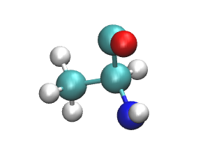

Alanine residue
===============

<p style="text-align:center;"></p>

```
{
    "molecule": {
        "types": [
            "N",
            "H",
            "C",
            "H",
            "C",
            "H",
            "H",
            "H",
            "C",
            "O"
        ],
        "positions": [
            [
                14.069999694824219,
                14.119998931884766,
                15.219999313354492
            ],
            [
                13.239999771118164,
                14.709999084472656,
                15.219999313354492
            ],
            [
                15.360000610351562,
                14.75999927520752,
                15.219999313354492
            ],
            [
                15.920000076293945,
                14.470000267028809,
                16.10999870300293
            ],
            [
                16.170000076293945,
                14.370000839233398,
                13.99000072479248
            ],
            [
                15.629999160766602,
                14.670000076293945,
                13.09000015258789
            ],
            [
                17.139999389648438,
                14.869999885559082,
                14.010000228881836
            ],
            [
                16.31999969482422,
                13.289999961853027,
                13.979999542236328
            ],
            [
                15.219999313354492,
                16.280000686645508,
                15.219999313354492
            ],
            [
                14.110000610351562,
                16.799999237060547,
                15.219999313354492
            ]
        ],
        "masses": [
            14.007,
            1.008,
            12.011,
            1.008,
            12.011,
            1.008,
            1.008,
            1.008,
            12.011,
            15.999
        ],
        "names": [
            "N",
            "H",
            "CA",
            "HA",
            "CB",
            "HB1",
            "HB2",
            "HB3",
            "C",
            "O"
        ],
        "bonds": [
            [
                [
                    0,
                    1
                ],
                [
                    0,
                    2
                ],
                [
                    2,
                    3
                ],
                [
                    2,
                    4
                ],
                [
                    2,
                    8
                ],
                [
                    4,
                    5
                ],
                [
                    4,
                    6
                ],
                [
                    4,
                    7
                ],
                [
                    8,
                    9
                ]
            ]
        ],
        "forcefield": "AMBER99"
    },
    "box": {
        "shape": "cube",
        "type": [
            "periodic",
            "periodic",
            "periodic"
        ],
        "bound": [
            [
                6.900000095367432,
                5.260000228881836,
                1.3199999332427979
            ],
            [
                24.75,
                17.920000076293945,
                28.850000381469727
            ]
        ]
    }
}
```
